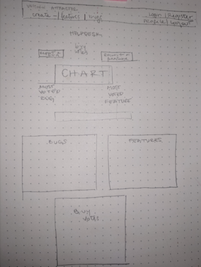

# Support Ticket System - Django Frameworks Project

This is the Django Fullstack Frameworks Unit Milestone Project, for Code Institute's Full Stack Web Developer Course.

## UX
The following preliminary wireframe was designed to represent the required website skeleton. It depicts the necessary elements to compose the Helpdesk.

 

## Features
This is the Helpdesk for the Unicorn Attractor App. The Unicorn Attractor App allows the user to emit our Super Secret Unicorn Frequency from their mobile device and attract 
all the Unicorns. The App page is linked to from the Navbar in the top right corner of the screen. The objective of the Helpdesk is to allow the users of the Unicorn Attractor App to report Bugs and to request Features 
they would like to have in the Unicorn Attractor App. 

In the Helpdesk home, a user can immediately see buttons that will take them to either Create a Ticket or to Buy Feature Votes.
Below, the user finds graphics displaying the amount of worked on features for each day, week, month and year (last twelve months).
The most voted Feature and Bug are also displayed. 
The Unicorn Attractor App developer will spend half of their time working on the highest voted Feature.

A logged in user can Create a Ticket as either a Feature or a Bug, Comment on a ticket and Buy Votes from the vote shop.
The user will need to have purchased Votes to Vote for a feature. 
Bugs can be upvoted free of charge.

An admin has all the actions of a user, plus the ability to edit and delete Tickets and Comments. These actions are available in the admin panel.
The admin panel also has the action of adding Worked On to a Feature or a Bug and to modify the Status of Tickets (Todo, Doing, Done).

An index with all existing Features and another one with all existing Bugs are visible for every user, logged in or not. These are linked from the Navbar at the top of the website. The Navbar has further links to Ticket Creation, Buy Votes,
the Unicorn Attractor App, the user's Profile and the actions of login and logout. 

In their Profile, the user can see their Order History.

Votes can be bought from the Helpdesk in the Buy Votes section, linked from the Navbar. 
When purchasing votes, the user is redirected to the Stripe checkout system to ensure secure card payments. 

Use the following credentials for the Admin User in the deployed version:
Username: admin
Password: 1234qwer

The admin passwords are different due to a Django limitation in live permitted passwords.

## Technologies Used

- HTML language, to write the web page layout. 

- CSS to style the application.

- Font Awesome (https://fontawesome.com/)
    Font and Icon toolkit

- Font Google (https://fonts.google.com/)
    Font toolkit.

- Bootstrap 4 (https://getbootstrap.com/docs/4.0/getting-started/introduction/)
    Framework used to uniform the layout. Also, the spacing utils section has been creaated from the information in https://getbootstrap.com/docs/4.1/utilities/spacing/.
    
- Lux Bootstwatch was used as a Theme (https://bootswatch.com/3/lux).

- Django (1.11) (https://www.djangoproject.com/), to create the backend application.

- ChartJs (https://www.chartjs.org), to display graphics showing worked on Features and Bugs.

- Heroku (https://www.heroku.com/), for production deployment.
    
- Sqlite3 database engine (https://www.sqlite.org/index.html). This was used for development.

- Postgres (https://www.postgresql.org), database engine used for the deployed version on Heroku.

- TravisCI (https://travis-ci.org/), for automated testing prior to development.

- Behave (https://behave.readthedocs.io/en/latest/), for Behaviour Driven Development.

- Selenium (https://selenium-python.readthedocs.io/api.html), for Web UI Automation Testing.

- Splinter (https://splinter.readthedocs.io/en/latest/), for testing through user Browser Action Automation.

- Stripe (https://stripe.com/gb), for secure card payments.

- GitKraken (https://support.gitkraken.com/), for management of Branch and Git commits.

- Python PEP8 checker (http://pep8online.com/)

- Amazon Web Services - S3 storage bucket (https://aws.amazon.com/), to serve static files.

- Boto3 to connect the S3 storage bucket to Django.

## Requirements
- [Python 3.4.9](https://www.python.org/downloads/release/python-349/) is required.

## Testing

Testing was performed through automated and manual tests. 

Python code is PEP8 compliant, checked through http://pep8online.com/

Travis CI integration was configured to perform automatic tests before deployment.

This application was extensively tested in different browsers, 
screen sizes and Operative Systems, since it was originally designed in an iMac.

An example of a manual browser test was User creation.

A. User Creation:
  1. In home, go to Register
  2. Submit a user name
  3. Submit an email address, must be valid
  4. Submit a password and confirm it
  5. See a welcome message beneath the Navbar
  6. Be allowed to upvote a Bug
  7. Be allowed to Buy Feature Votes
  8. Be allowed to vote on a Feature
  9. Logout with link in Navbar
  
  
## Deployment

This project was deployed through Heroku, it can be found here:
https://issuetrackersystem.herokuapp.com/

Heroku allows automatic deployment from a chosen branch.
Travis CI integration was configured to perform automatic tests before every deployment.

In this case, the deployed branch is the master branch. 

Development was done in the Development branch managed through GitKraken.
A separate Feature branch was used to develop each of the individual features.

Postgresql Database is used in the deployed version instead of SQLite, which was used for development. SQLite is not 
suitable for Heroku, since Heroku deploys a managed container system and will therefore erase any added or edited 
information in the live version with each deployment.

The deployed version utilizes an Amazon Web Services S3 Storage Bucket to serve static files. These files are created by Heroku's build system.

For environment variables in development .env was used. For deployment, the variables were manually set.

## Run code locally
### Preparation 
- Clone repository
- Copy `.env.example` to `.env` and enter values for all environmental variables listed.
- Run `pip install -r requirements.txt` (or `pip3` if necessary for Python 3).

### Set up
- Run any migrations using `python3 manage.py migrate`
- Run `python3 manage.py loaddata accounts` to seed database. 

Use the following credentials in order to test Admin function locally:
 - Username: admin
 - Password: password

- Run `python3 manage.py runserver` and browse to generated local URL.

## Media
Image in Unicorn Attractor App adapted by me from a Royalty-free stock vector from Shutterstock.com (ID: 766763503, Unicorn minimalistic face 
horn cute sleeping, by Tereez/Shutterstock.com, https://shutr.bz/2kMHC27).

## Acknowledgements
Inspiration for this project was obtained from Code Institute's Django Fullstack Frameworks Unit.
Sections like the Accounts app were developed previously as coursework for this Module.